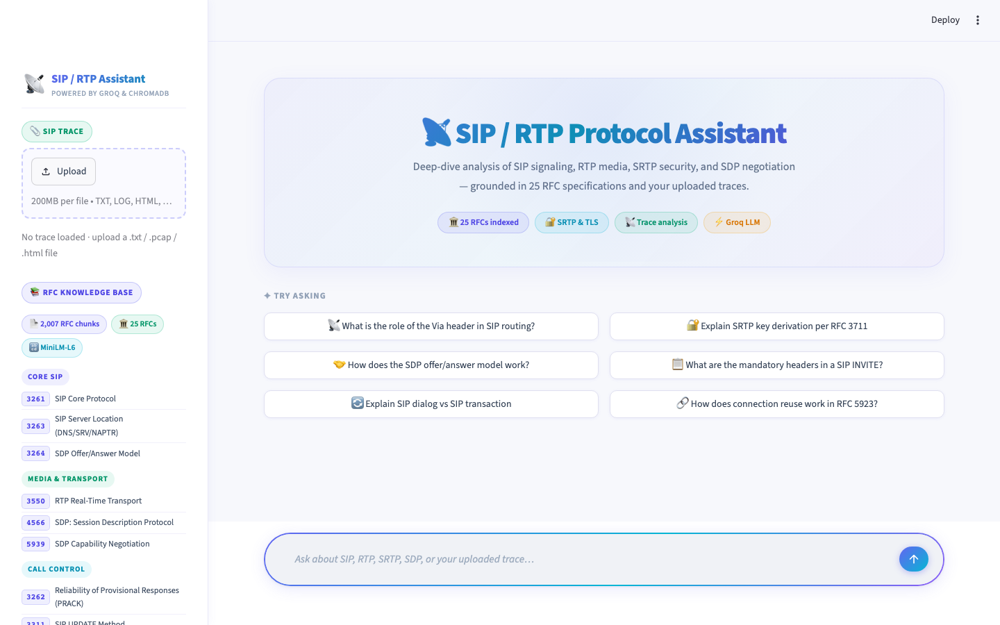
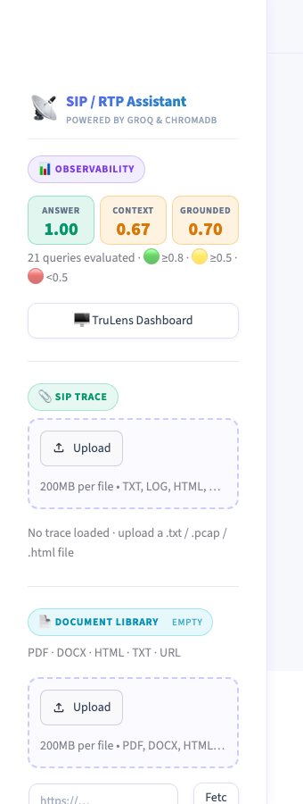
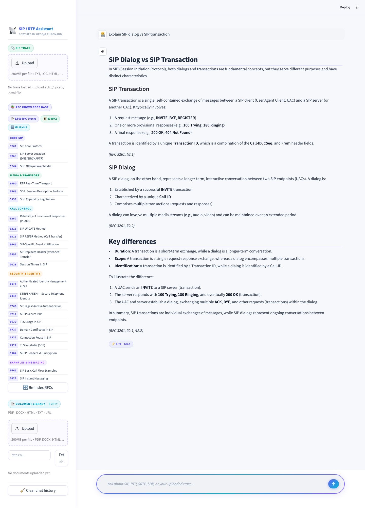

# VOIP / SIP RFC Agentic RAG

An agentic RAG system for SIP and VoIP protocol analysis. Ask protocol questions grounded in 23 IETF RFCs, or upload a SIP trace and get a detailed diagnostic report — with every claim cited back to the governing RFC.

Built with **LangGraph**, **Groq (Llama 4 Scout)**, **ChromaDB**, and **Streamlit**.

---

## Screenshots

**Landing page** — sidebar with RFC knowledge base, trace upload, and example questions



**RFC Knowledge Base sidebar** — 25 RFCs organised by category



**Chat response** — structured answer with inline RFC citations and response time



---

## Features

- **RFC Knowledge Base** — 25 SIP/RTP/SDP RFCs ingested, chunked, and embedded into a local ChromaDB vector store
- **Hybrid BM25 + semantic search** — every RFC query runs dense (cosine/HNSW) and sparse (BM25Okapi) retrieval in parallel, fused with Reciprocal Rank Fusion (RRF); handles both natural-language questions and isolated acronyms equally well
- **Agentic reasoning** — LangGraph ReAct loop with up to 14 tool-call iterations per query
- **SIP trace analysis** — upload a `.pcap` or SIP text capture; the agent reconstructs the call flow, extracts SDP bodies, and diagnoses errors
- **Document Q&A** — upload PDFs, DOCX, HTML, or plain text files; the agent searches them alongside the RFC knowledge base
- **Groq + Ollama fallback** — primary inference via Groq API; automatic fallback to a local Ollama model on HTTP 429 rate-limit
- **Auto-diagnostic report** — one-click 9-section analysis of any uploaded trace (signaling path, media/codecs, authentication, security, timing, compliance)

---

## Agent Tools

| Tool | Description |
|---|---|
| `search_rfc` | Semantic search over the RFC knowledge base |
| `search_trace` | Semantic search over an uploaded SIP trace |
| `reconstruct_call_flow` | Rebuild ordered SIP dialogs from a trace (grouped by Call-ID, sorted by CSeq) |
| `diagnose_sip_error` | RFC definition and common causes for any 4xx / 5xx / 6xx response code |
| `cross_reference` | Given a trace observation, retrieve the governing RFC rule |
| `search_docs` | Semantic search over user-uploaded documents |

---

## RFC Coverage

| Category | RFCs |
|---|---|
| Core SIP Protocol | 3261, 3263, 3264 |
| Media & Transport | 3550, 4566, 5939 |
| Call Control, Routing & Events | 3262, 3311, 3515, 6665, 3891, 4028 |
| Security & Identity | 4474, 7340, 8760 |
| Media Security & Transport | 3711, 5630, 5922, 5923, 4572, 6904 |
| Examples & Messaging | 3665, 3428 |
| DTMF & INFO | 4733, 6086 |

---

## Architecture

```
Streamlit UI (app.py)
        │
        ▼
AgentOrchestrator (LangGraph StateGraph)
        │
   ┌────┴────┐
   │  agent  │◄──────────────────┐
   │  node   │                   │
   └────┬────┘                   │
        │ tool_calls?            │
        ▼                        │
   ┌─────────┐                   │
   │  tools  │ ──────────────────┘
   │  node   │  (ToolNode loops back)
   └─────────┘
        │
   ┌────┴──────────────────────────────┐
   │  search_rfc  /  search_trace      │
   │  reconstruct_call_flow            │
   │  diagnose_sip_error               │
   │  cross_reference  /  search_docs  │
   └───────────────────────────────────┘
        │
   ChromaDB (local vector store)
```

**LLM routing:**
- Primary: Groq `meta-llama/llama-4-scout-17b-16e-instruct`
- Fallback: Ollama `gemma4:e4b` (activated automatically on Groq HTTP 429)


---

## Prerequisites

- Python 3.10+
- A [Groq API key](https://console.groq.com/)
- *(Optional)* [Ollama](https://ollama.com/) running locally for rate-limit fallback

---

## Installation

```bash
git clone https://github.com/vinu87a/VOIP_SIP_RFC_AGENTIC_RAG.git
cd VOIP_SIP_RFC_AGENTIC_RAG

python -m venv venv
source venv/bin/activate   # Windows: venv\Scripts\activate

pip install -r requirements.txt
```

---

## Configuration

Create a `.env` file in the project root:

```env
GROQ_API_KEY=your_groq_api_key_here

# Optional — only needed for Ollama fallback
OLLAMA_MODEL=gemma4:e4b
OLLAMA_BASE_URL=http://localhost:11434
```

---

## Build the Knowledge Base

Download and ingest all 25 RFCs into the local ChromaDB vector store (run once):

```bash
python -m ingest.rfc_fetcher      # downloads RFC text files to rfc_cache/
python -m ingest.doc_ingest       # chunks and embeds into chroma_db/
```

---

## Run

```bash
streamlit run app.py
```

Open [http://localhost:8501](http://localhost:8501) in your browser.

---

## Usage

**Protocol questions** — type any SIP/RTP/SDP question in the chat box. The agent searches the RFC knowledge base and cites specific RFC sections inline.

**Trace analysis** — upload a `.pcap`, `.txt`, or `.log` SIP capture via the sidebar. Use the *Auto-Analyse* button for a full 9-section diagnostic report, or ask targeted questions.

**Document Q&A** — upload PDFs, DOCX files, HTML pages, or paste a URL in the sidebar. The agent searches your documents alongside the RFC knowledge base.

---

## Project Structure

```
VOIP_SIP_RFC_AGENTIC_RAG/
├── app.py                  # Streamlit UI
├── config.py               # Model config, RFC list, chunk settings
├── requirements.txt
├── agent/
│   ├── orchestrator.py     # LangGraph graph, Groq/Ollama routing
│   ├── tools.py            # Tool implementations (search, trace, diagnose)
│   └── prompts.py          # System prompt and trace playbooks
├── ingest/
│   ├── rfc_fetcher.py      # Downloads RFCs from ietf.org
│   ├── rfc_chunker.py      # Text chunking with overlap
│   ├── doc_ingest.py       # PDF / DOCX / HTML / URL ingestion
│   └── parsers/            # HTML, PCAP, and plain-text parsers
├── store/
│   └── vector_store.py     # ChromaDB wrapper (RFC + trace + doc collections)
├── chroma_db/              # Local vector store (git-ignored)
└── rfc_cache/              # Downloaded RFC text files (git-ignored)
```

---

## Stack

| Component | Library |
|---|---|
| Agent framework | LangGraph 0.2+ |
| LLM (primary) | Groq via `langchain-groq` |
| LLM (fallback) | Ollama via `langchain-ollama` |
| Embeddings | `sentence-transformers` (all-MiniLM-L6-v2) |
| Vector store | ChromaDB |
| PCAP parsing | Scapy |
| UI | Streamlit |
